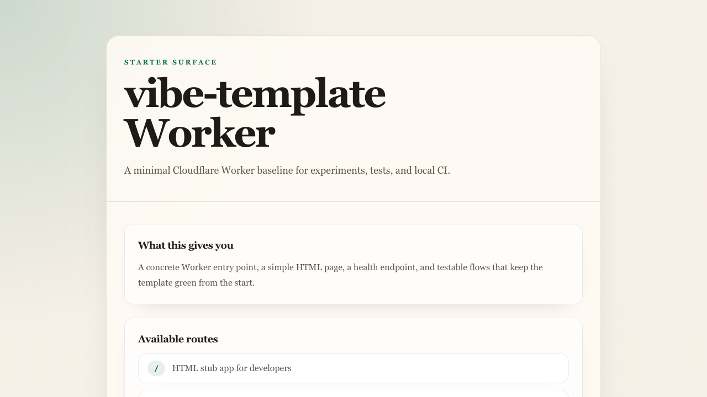

# vibe-template

`vibe-template` currently ships as a Cloudflare Worker application served with Wrangler, implemented in JavaScript/TypeScript, and centered on server-rendered HTML with a small JSON API stub.

This is a template for my vibecoding projects and it captures what I consider my best practices so I don't have to repeat them for each experiment.

The repo vendors ASDLC reference material in `.asdlc/` as local guidance instead of recreating it per project. Repo-specific truth lives in `ARCHITECTURE.md`, `specs/`, and `docs/adrs/`: generated code still needs to match those documents, and passing CI alone is not enough.

Local development in this repo targets macOS. Other platforms may need script and tooling adjustments before the baseline workflow works as documented.

## Documentation

- Development setup and local CI: `docs/development.md`
- Architecture decisions: `docs/adrs/README.md`
- Feature and architecture specs: `specs/README.md`
- Agent behavior and project rules: `AGENTS.md`
- Project-local agent capabilities: `.codex/skills/`
- Partial-upgrade capability kits: `.capabilities/`
- Template maintenance update packs: `.template/updates/`

## Agent Skills

The repository includes compact instructions under `.codex/skills/` that help capable coding agents follow project-specific conventions without repeating generic engineering guidance. Version-sensitive details come from current primary sources. You can describe the job normally and let the agent select a matching skill, or require one by name—for example, `Use $security to review this authentication change`.

`$start-project`, `$wayfinder`, and `$to-spec` are intentionally explicit: the agent uses them only when you name them. This keeps repository pruning, exploratory maps, and durable specifications from appearing as accidental side effects.

### From Idea to Implementation

- [`$start-project`](.codex/skills/start-project/SKILL.md) — define a fresh clone's first closed product loop, audit inherited template material, and present an approval-gated pruning plan before changing files. Explicit invocation required.
- [`$brainstorming`](.codex/skills/brainstorming/SKILL.md) — compare lightweight approaches and clarify trade-offs before committing to a design.
- [`$wayfinder`](.codex/skills/wayfinder/SKILL.md) — map a large, uncertain, multi-session initiative in `docs/wayfinding/` when it is not ready for a responsible spec. Explicit invocation required.
- [`$to-spec`](.codex/skills/to-spec/SKILL.md) — turn settled discussion or wayfinding results into the repository's living `specs/<feature-domain>/spec.md`. Explicit invocation required.
- [`$tdd`](.codex/skills/tdd/SKILL.md) — implement observable runtime behavior through focused red-green slices when a stable test seam exists.
- [`$debug`](.codex/skills/debug/SKILL.md) — reproduce and localize failures, fix their root cause, add a regression guard, and verify the result.
- [`$simplify`](.codex/skills/simplify/SKILL.md) — reduce incidental complexity in recently changed code without altering behavior.

### Review and Risk

- [`$review`](.codex/skills/review/SKILL.md) — perform a broad, prioritized review for bugs, regressions, and readiness gaps.
- [`$correctness-review`](.codex/skills/correctness-review/SKILL.md) — inspect changed logic specifically for behavioral errors, edge cases, and broken contracts.
- [`$test-review`](.codex/skills/test-review/SKILL.md) — evaluate whether tests cover meaningful behavior without becoming brittle or redundant.
- [`$security`](.codex/skills/security/SKILL.md) — review authentication, secrets, access control, data exposure, and input-handling risks proportionately.
- [`$architecture-review`](.codex/skills/architecture-review/SKILL.md) — decide whether a growing capability can expand safely or should consolidate its ownership and dependency boundaries first.

### Frontend and Performance

- [`$frontend-design`](.codex/skills/frontend-design/SKILL.md) — design or substantially revise production-quality UI while preserving the starter's reusable nature.
- [`$minimal-visual-style`](.codex/skills/minimal-visual-style/SKILL.md) — extend the existing minimal, editorial, token-driven visual language.
- [`$modern-web-guidance`](.codex/skills/modern-web-guidance/SKILL.md) — retrieve pinned, telemetry-disabled, Baseline-aware implementation guidance for substantive browser-platform work.
- [`$web-perf`](.codex/skills/web-perf/SKILL.md) — measure Core Web Vitals, loading behavior, interaction responsiveness, and network costs.

### Cloudflare and Validation

- [`$workers-best-practices`](.codex/skills/workers-best-practices/SKILL.md) — author or review Worker code using current production guidance and repository conventions.
- [`$wrangler`](.codex/skills/wrangler/SKILL.md) — guide Wrangler configuration and commands for local development, bindings, deployment, and platform resources.
- [`$local-ci`](.codex/skills/local-ci/SKILL.md) — run the repository's GitHub Actions workflow locally for workflow-sensitive or release-readiness validation.

Each linked `SKILL.md` is the source of truth for boundaries and workflow details. Project-wide routing rules live in [`AGENTS.md`](AGENTS.md).

## Runtime

- Run `nvm use` before `npm install` or any other development command so your shell picks up the repo-pinned Node.js version from `.nvmrc` and stays close to the expected npm baseline.
- Install dependencies with `npm install`.
- `npm install` also configures the repo-managed `pre-push` hook so `git push` runs affected guardrails before code leaves your machine.
- The exact project Node.js version is pinned in `package.json` and mirrored in `.nvmrc` for `nvm` users, and CI reads the `package.json` value directly.
- npm is constrained to the supported npm 11 range in `package.json`; local development is expected to use `nvm use`, and CI uses the npm release bundled with the pinned Node setup as long as it satisfies that range.
- Copy `.dev.vars.example` to `.dev.vars` before running projects that need local secrets.
- Use repo-pinned CLI tools through `npx`, including `npx wrangler` for Cloudflare-based experiments.
- Start the stub Worker with `npm run dev`, then open `http://127.0.0.1:8787`.
- Rebuild the generated Tailwind stylesheet manually with `npm run build:css` when needed.

## Verification

- Run the fast local gate with `npm run quality:gate:fast` during normal iteration.
- Run the baseline repo gate with `npm run quality:gate`.
- Verify the executable Workers capability kits in isolated temporary adopters with `npm run capabilities:verify`.
- Run `npm run preflight` before deployment to check the pinned runtime, Wrangler authentication, declared bindings, and a non-provisioning deploy dry run.
- Run the deterministic source-shape smoke alarms directly with `npm run quality:structure`; threshold failures call for architecture review or an exact rationale-bearing exception, not mechanical file splitting.
- Run the containerized local workflow with `npm run ci:local` when changing GitHub Actions, dependencies or installation behavior, build or container setup, browser CI setup, or when performing a full PR or release readiness check. It emits structured run, job, and step progress for agents, uses Local CI parallelism with warm-cache serialization, and pauses failed runners for retry.
- Run advisory codebase readability diagnostics with `npm run diagnostics:codebase`.
- The repo-managed `pre-push` hook runs `npm run quality:affected` automatically after `npm install`.
- If Local CI warns about `No such remote 'origin'`, set `GITHUB_REPO=owner/repo` in `.env.local-ci`.
- Retry a paused local CI run with `npm run ci:local:retry -- --name <runner-name>`.
- Install the pinned Playwright browser with `npm run playwright:install`.
- Run unit tests from colocated `src/**/*.test.ts` files with `npm test`.
- Run browser tests from colocated `src/**/*.e2e.ts` files with `npm run e2e`.
- Run mutation tests against runtime `src/**/*.ts` files with `npm run mutation`.

## Capability Kits

Use `.capabilities/` when another project needs one template practice without adopting the whole starter. Each kit is a reviewable partial-upgrade guide with a README, manifest, package-manager recipe, copyable files, and validation checks.

The `engineering-quality-skills` kit exposes focused correctness review, test review, and systematic debugging workflows to downstream coding agents without adding runtime dependencies.

The application-facing kits stay opt-in: `workers-ai` adds a typed structured-output boundary and fallback, `room-state` adds one SQLite-backed Durable Object per room, and `progressive-interaction` enhances conventional forms without making JavaScript mandatory. They contain no lecture-specific prompts, choices, URLs, or seed data.

To apply a kit to another repo:

1. Pick the smallest matching kit from `.capabilities/README.md`.
2. Read the kit README and `manifest.json`.
3. Follow the target package-manager recipe under `recipes/`.
4. Copy or merge files from `files/` without overwriting target-project conventions.
5. Ask before applying optional adjacent setup such as creating a GitHub Actions workflow.
6. Run the kit checks and the target repo's normal quality gate.

For existing projects where the right kit set is unclear, start with the negotiation prompt in `.capabilities/README.md`. It asks an agent to inspect the target repo, present a checkbox-style capability pull plan, and wait for approval before editing files.

## Template Update Packs

Use `.template/updates/` to sync later maintenance changes into projects that already use this template or one of its capability kits. Each update pack has metadata, a short migration guide, and a focused patch to try before porting the change manually.

For cross-repo agent work, tell the agent:

> Look at `vibe-template/.template/updates/AGENT_SYNC.md` for latest template updates.

## Starter App

- `GET /` serves a minimal editorial Worker stub with a route index and a primary health-probe link.
- `GET /styles.css` serves the generated Tailwind stylesheet.
- `GET /api/health` serves a JSON health response for smoke tests and tooling.

## Source Layout

- `src/worker.ts` is the Worker entry point and top-level router.
- `src/api/` holds API response modules such as the health endpoint.
- `src/views/` holds HTML rendering modules for the starter UI.
- Tests live next to the code they exercise under `src/`.

## Application Screenshot

Refresh this asset manually when the starter UI changes materially.
